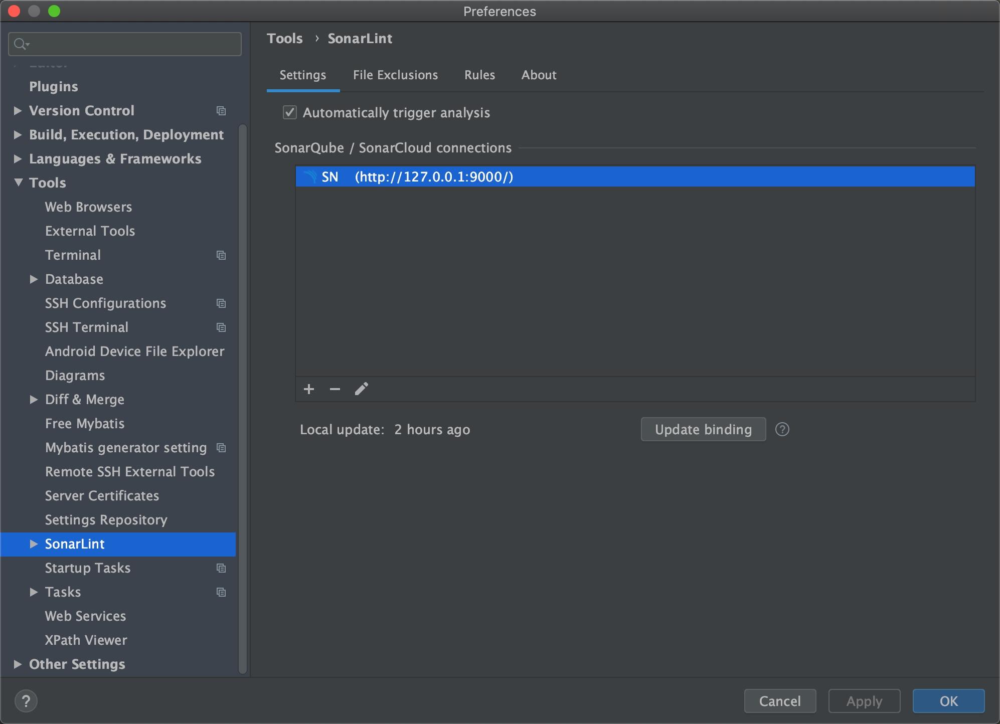
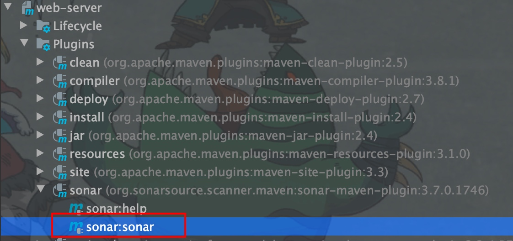
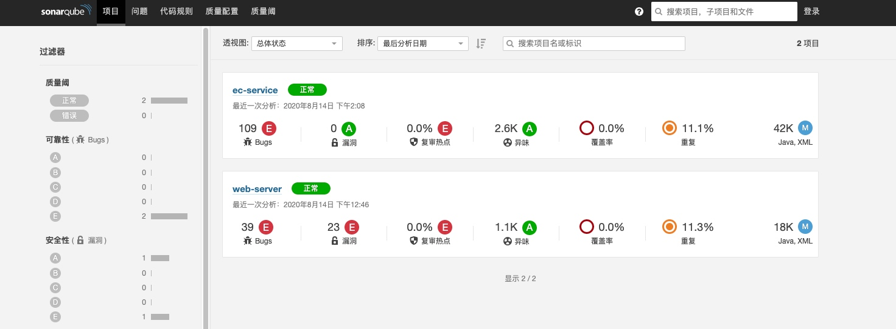
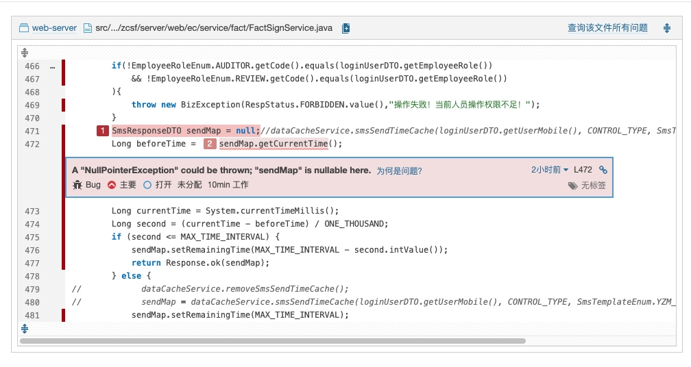

# review代码审查
## 服务端 -- Docker
拉取镜像`docker pull sonarqube`
启动镜像`docker run -d --name sonarqube -p 9000:9000 -p 9092:9092 sonarqube`
登录页面: 127.0.0.1:9000

## 客户端 -- Idea插件
1. 安装`sonarlint`
2. 添加访问地址


4. pom中配置
```xml
<plugin>
        <groupId>org.sonarsource.scanner.maven</groupId>
        <artifactId>sonar-maven-plugin</artifactId>
        <version>3.7.0.1746</version>
</plugin>
```    
4. 运行指令:


5. 本地启动镜像查看审查结果


6. 查看问题进行修改


---END---
